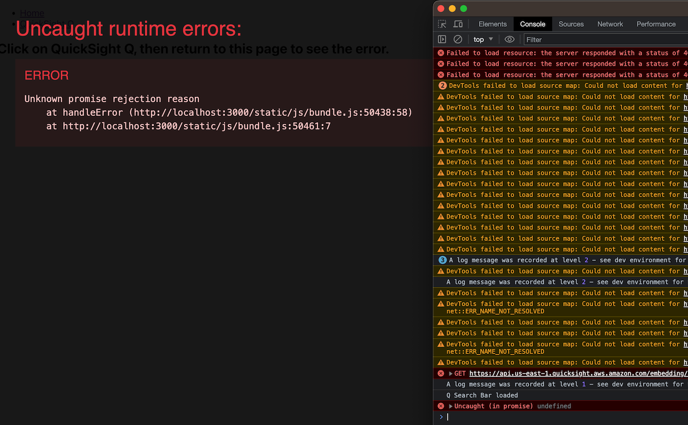

# QuickSight Q Search Bar Error Example

This React project demonstates the error we are experiencing with the Q Search Bar in the current version (2.2.2) of the QuickSight Embedding SKD.

## The Error
Error: After loading the search bar then routing to another page, there is an "Uncaught (in promise) undefined" error thrown in the console.

There is also an error pulling the theme in, but we are still investigating that. 



# Running this project
To run this project:

1. Clone the repo
```
gh repo clone bbShannonHoffman/qs-q-error-example
```

2. Enter the main folder
```
cd qs-q-error-example/
```

3. Install the packages
```
npm install
```

4. Change the url the the Q Search Bar uses in /components/QSearchBar.tsx
You will need to have a valid url to use to replace 'YOUR_Q_SEARCH_BAR_URL' in the /components/QSearchBar.tsx file. You will also need to ensure that localhost has been enabled as a valid domain in the QS console.

5. Run the app
```
npm start
```

After the app has loaded, navigate to the QSearchBar page, then route back to Home. The console will show an error 

## Available Scripts

In the project directory, you can run:

### `npm start`

Runs the app in the development mode.\
Open [http://localhost:3000](http://localhost:3000) to view it in the browser.

The page will reload if you make edits.\
You will also see any lint errors in the console.

### `npm test`

Launches the test runner in the interactive watch mode.\
See the section about [running tests](https://facebook.github.io/create-react-app/docs/running-tests) for more information.

### `npm run build`

Builds the app for production to the `build` folder.\
It correctly bundles React in production mode and optimizes the build for the best performance.

The build is minified and the filenames include the hashes.\
Your app is ready to be deployed!

See the section about [deployment](https://facebook.github.io/create-react-app/docs/deployment) for more information.

### `npm run eject`

**Note: this is a one-way operation. Once you `eject`, you can’t go back!**

If you aren’t satisfied with the build tool and configuration choices, you can `eject` at any time. This command will remove the single build dependency from your project.

Instead, it will copy all the configuration files and the transitive dependencies (webpack, Babel, ESLint, etc) right into your project so you have full control over them. All of the commands except `eject` will still work, but they will point to the copied scripts so you can tweak them. At this point you’re on your own.

You don’t have to ever use `eject`. The curated feature set is suitable for small and middle deployments, and you shouldn’t feel obligated to use this feature. However we understand that this tool wouldn’t be useful if you couldn’t customize it when you are ready for it.

## Learn More

You can learn more in the [Create React App documentation](https://facebook.github.io/create-react-app/docs/getting-started).

To learn React, check out the [React documentation](https://reactjs.org/).
